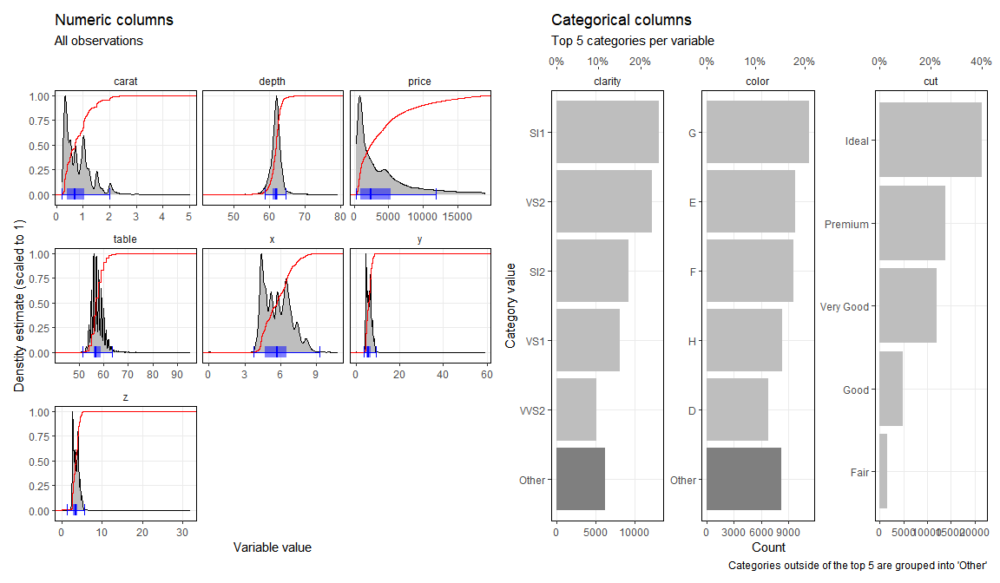
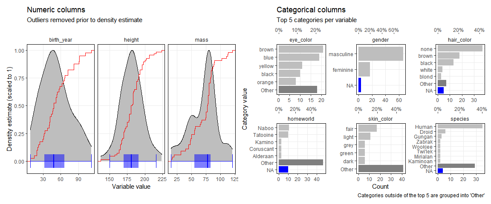

# holmesr 

**This code is designed and shared for my own personal use and will
always be a work in progress, with bugs, issues and outright errors\!
Use at your own risk**

The goal of `holmesr` is to collate (and make portable) a miscellany of
my personal R functions.

Some of the more useful functions

  - Visualisation
      - `dists()`
      - `numeric_dists()`
      - `categoric_dists()`
      - `rotate_x_labs()`
      - `geom_origin()`
      - `move_legend()`
      - `theme_holmes()`
  - Data wrangling
      - `remove_outliers()`
      - `print_all()`

Install package, add it to the search path and set the plotting theme

``` r
remotes::install_github('cj-holmes/holmesr')
```

``` r
library(holmesr)

# Set the holmesr plotting theme
ggplot2::theme_set(theme_holmes())
```

### Visualising dataframe distributions

Probably the most useful function is `dists()` which returns a plot of
the distributions of numeric and categorical columns in a dataframe.

``` r
dists(ggplot2::diamonds)
```

<!-- -->

Ther are several arguments for customisation, including
`remove_outliers` to remove outliers before numerical distirutions are
computed, and `cols` for selecting the columns to include/not include
with tidyselect semantics. For instance, when a categorical column
contains unique values for every row (the `dplyr::starwars` `name`
column) it is useful to not plot its distribution (below)…

``` r
dists(dplyr::starwars, remove_outliers = TRUE, cols=c(-name, -sex))
```

<!-- -->

Arguments passed to `...` are passed on to `patchwork::wrap_plots` and
control the layout of the visualisation (`ncol`, `nrow`, `widths`,
`heights`, etc…)
