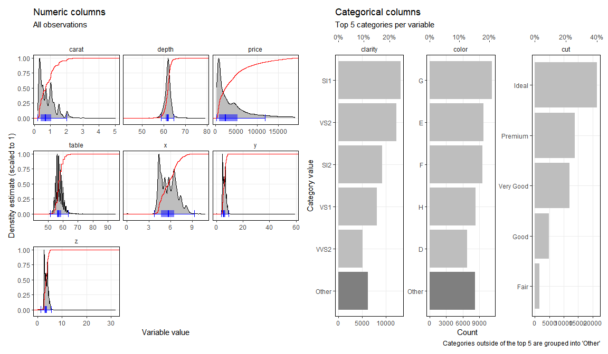

# holmesr 

The goal of `holmesr` is to collate (and make portable) a miscellany of
my personal R functions.

Some of the more useful functions

  - Visualisation
      - `dists()`
      - `numeric_dists()`
      - `categoric_dists()`
      - `rotate_x_labs()`
      - `geom_origin()`
      - `move_legend()`
      - `theme_holmes()`
  - Data wrangling
      - `remove_otliers()`
      - `print_all()`

Install package, add it to the search path and set the plotting theme

``` r
library(holmesr)

# Set the homesr plotting theme
ggplot2::theme_set(theme_holmes())
```

### Visualising dataframe distributions

``` r
dists(ggplot2::diamonds)
```

<!-- -->

``` r
dists(dplyr::starwars, remove_outliers = TRUE, cols=c(-name, -sex))
```

<!-- -->
